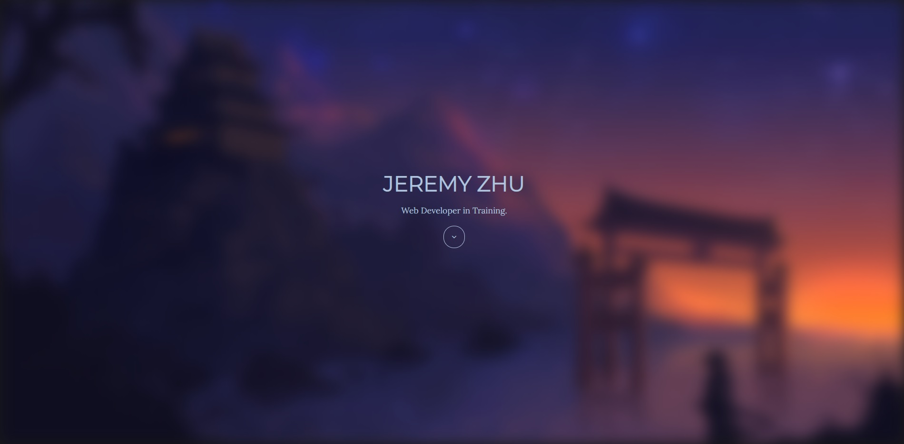
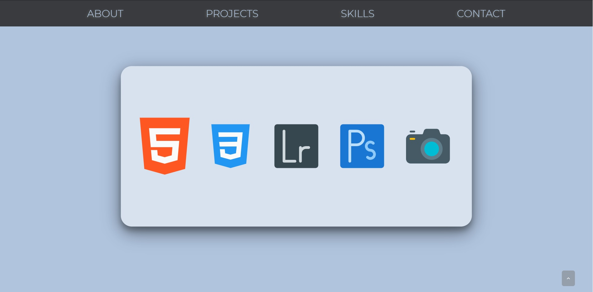
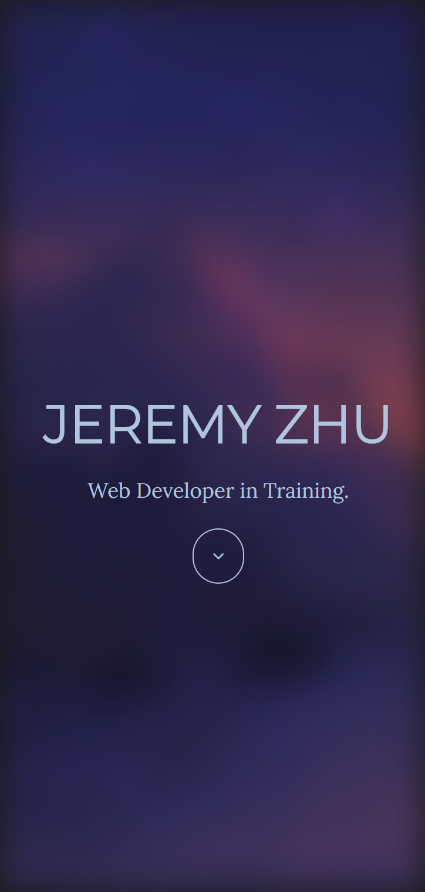
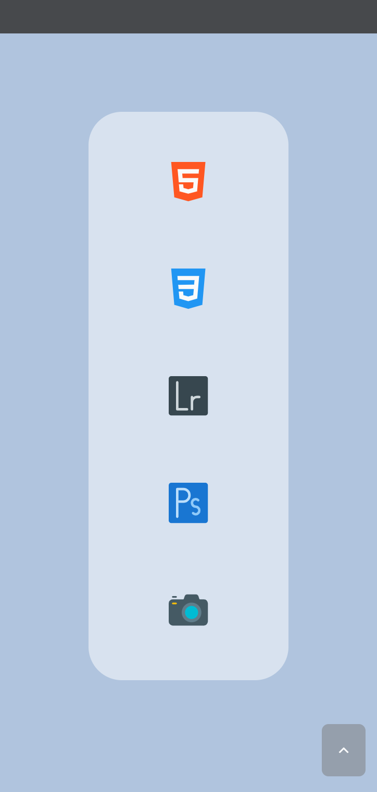

# Jeremy Zhu's First Portfolio Website // Jeishu
This is our first homework assign when we had to start from scratch. Using our lectures, activities, and outside resources, we had to create a website with HTML and CSS (maybe Javascript, if we are feeling comfortable with it.)

## Motivation
Besides this project being a homework, I was actually extremely excited to make my own website from scratch. Prior to this class, I had no knowledge in HTML and CSS.

## Table of Contents
* [Features](#Features)
* [Screenshots](#Screenshots)
* [Code-Example](#Code-Example)
* [Reference](#Reference)
* [Tests/Issues](#Test/Issues)
* [Contribute](#Contribute)
* [Credits](#Credits)
* [License](#License)

## Features
This portfolio was mostly done with HTML and CSS, just one Javascript for the "scroll to top" action. No Bootstrap was used, we did not learn that in class. 
Throughout the entire website, I used a lot of pseudo element (hover, focus, after), and used small transition styles to make the motion look as clean as possible.
Utilize a good amount of media queries to help my website be more responsive to almost any screen size.

## Screenshots

These are desktop views:




These are iPhone X view:




## Code-Example
I utilized spaces and comments in HTML and CSS to organize and divide the sections up.
```
  <!-- ===== Landing Page ===== -->
        <header id="mountain">
            <div class="content">
                <h1>Jeremy Zhu</h1>
                <p>
                    Web Developer in Training.
                </p>
                <a href="#nav" class="button"><i class="fa fa-angle-down"></i></a>
            </div>
        </header>
        
    <!-- ===== Navigation Bar ===== -->
        <section class="navigationBar" id="nav">
            <nav>
                <ul class="navContainer" id="navbar"> 
                    <li>
                        <a href="#aboutBtn">About</a>
                    </li>
                
```
Spaces used for divding up the styles in CSS || Comments used to help indicate the Flexbox Parent
```
   /* flexbox parent :: img div.aboutInfo */
.aboutCard {
    display: flex;
    justify-content: center;
    align-items: center;
}
    /* flexbox parent  :: p.name p.title p.info */
.aboutInfo {
    display: flex;
    flex-direction: column;
    justify-content: space-evenly;
}
.about img {
    width: 20rem;
    height: auto;

    margin: 1rem;
    padding: 2rem;

    float: left;
    border-radius: 3rem;
    transition: all .5s;
}
```

## Reference
These are what I used to help me create my portofolio
> - [CSS-Tricks](https://css-tricks.com/) || Learn most of my CSS from this website.
> - [Developer Mozilla](https://developer.mozilla.org/en-US/) || Learn most of my tag definitions here.
> - [W3School](https://www.w3schools.com/) || Learn many tricks (creating a form, hover effect, buttons, etc) here.
> - [GitHub Docs](https://docs.github.com/en/free-pro-team@latest/github/writing-on-github/basic-writing-and-formatting-syntax) || Learn most of my README syntax here.
> - [Akash Nimare](https://medium.com/@meakaakka/a-beginners-guide-to-writing-a-kickass-readme-7ac01da88ab3) || Based my README from his person.
> - [Traversy Media](https://www.youtube.com/channel/UC29ju8bIPH5as8OGnQzwJyA) || Watched his basics to HTML and CSS and other video to help create this website.

## Tests/Issues
I utilized the Chrom Dev Tool to help fix many problems that I had encountered
- overflow-x: I had some contents, padding, margin, etc that would exceed the actual viewport.
    - this also conflicted with my Javascript, thus I had to fix the issue with my media queries.
- layout problems: I initially used CSS Grids for my website, but the CSS grids got more and more complicated, switch to Flexbox


## Contribute
- My class instructor, Calvin
- My tutor, Sangeetha
- My classmates and study groups

## Credits
> [DevFolio](https://bootstrapmade.com/demo/themes/DevFolio/)
- A good amount of inspirations came from this portfolio (Thanks Dora for linking this.)

> [Pixel Perfect](https://www.flaticon.com/authors/pixel-perfect), [icon54](https://icon54.com/)
- My skill section icons are all from this author.
- Also, they have an excellent website to receive inpiration from.

> [Wallpaper Flare](https://www.wallpaperflare.com/)
- This is where I got my background image from, also used for my temporary Project's Image.

## License
MIT © [Jeremy Zhu](2020)

